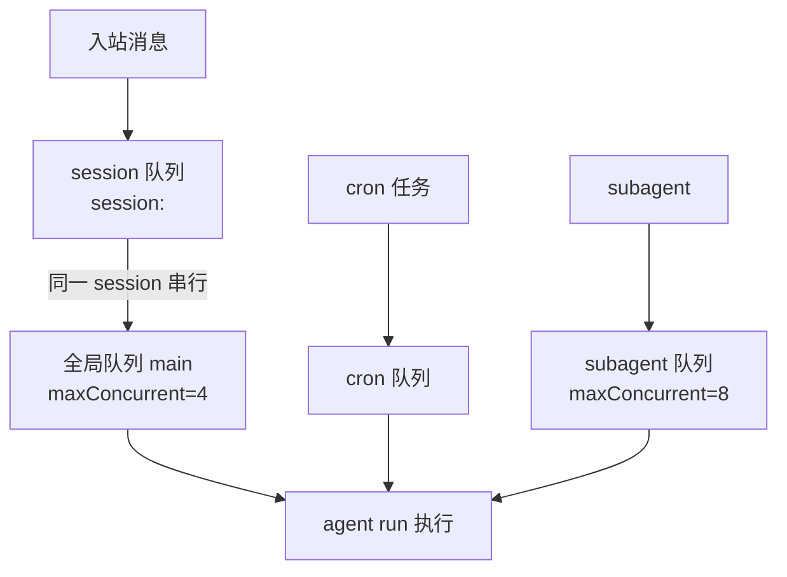
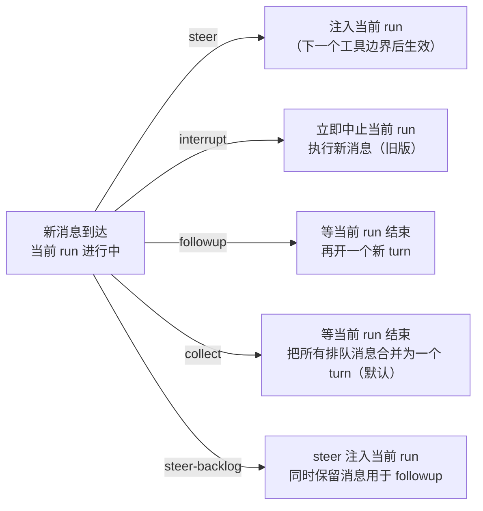

# 1. OpenClaw 是什么

## 1.1 官方定位

OpenClaw [官网](https://openclaw.ai/)、[官方仓库](https://github.com/openclaw/openclaw)和[官方文档](https://docs.openclaw.ai/)都把它描述为运行在个人设备上的 AI 助手系统，而不是托管式 SaaS 聊天产品。

其核心思想可以概括为三点：

- `self-hosted gateway`：真正长期运行的是 Gateway，assistant 只是建立在 Gateway 之上的产品体验。
- `multi-surface access`：它可以接入 WhatsApp、Telegram、Discord、Web UI、CLI 等多种入口。
- `tool-using assistant`：它不是只负责回答问题，而是把浏览器、终端、文件处理等能力挂到同一个 agent 体系里。

官方 [VISION.md](https://raw.githubusercontent.com/openclaw/openclaw/main/VISION.md) 里对方向的表述很明确：目标不是做另一个只会对话的 AI，而是做“**the AI that actually does things**”。

## 1.2 起源


从公开时间线看，openclaw的演化过程，可以把它概括成四个阶段（[Lore 页面](https://docs.openclaw.ai/zh-CN/start/lore)）：

1. `Warelay` 阶段  
   在最早期，是一个偏 WhatsApp gateway 的系统，名字叫 `Warelay`。历史 README 里，项目标题就是 Warelay — WhatsApp Relay CLI (Twilio)，功能写得很直白：用 Twilio 发送、监听、Webhook 处理 WhatsApp 消息，并支持配置式自动回复。所以更准确地说，Warelay 像是 OpenClaw 的“消息入口层原型”：它一开始解决的是“怎么把系统接进 WhatsApp”，然后才逐步长成今天更完整的 OpenClaw。
2. `Clawd / 早期龙虾叙事` 阶段  
   官方 lore 页面把项目中的龙虾人格写成 `Clawd`，并明确给出了一个时间范围：`2025 年 11 月 25 日 - 2026 年 1 月 27 日`。这一阶段最重要的不是具体产品名，而是项目开始把“AI agent + 龙虾人格 + 长期记忆 + shell access”这些元素合并成一种独特的社区叙事。
3. `Moltbot：2026 年 1 月`  
   由于和 `Claude` 发音过近，改名为Moltbot，但这个名字说起来也不太顺口……
4. `最终形态：2026 年 1 月 30 日`  
   1 月 27 日凌晨 5 点，社区成员聚集在 Discord。数百个名字被提议：Shelldon、Pinchy、Thermidor、Crusty、Lobstar、Nacre、Scuttlebot……最终，OpenClaw 胜出。因为蜕壳是龙虾成长的方式。而成长正是正在发生的事情。这只被称为 Clawd 的甲壳类动物正式蜕壳了。

名字的含义：

```
OpenClaw = OPEN + CLAW

= 开源，向所有人开放

= 我们的龙虾传承，我们从何而来

= 钳即是法 🦞

= 你的助手。你的机器。你的规则。
```


## 1.3 OpenClaw爆火的原因？

个人觉得，相比于claude code，codex这类coding Agent，openclaw做对的几件事：

1. 打通了日常用的通讯软件。Agent对话的入口不是终端命令行，而是日常用的软件，对大众来说是一件很重要的事。毕竟除了程序员，有几个人会打开cmd呢？
2. 能做coding，但不止于coding。作为一个中台，把电脑的其他软件连接起来了（coding agent，比如claude code、codex只是openclaw可以用的一个工具），从而可以做一些日常任务（日程管理、邮件管理、飞书编辑文档之类的）。能做的事更多，就更像一个“个人助手”了，而不只是一个coding 助手。所以openclaw火了之后，Anthropic 和OpenAI也快速拓展了claude code和codex的scope，推出了能干更多活的桌面级应用：

   1. Claude Cowork

      - 2026年1月12日：Anthropic 在官方 [Release notes](https://support.claude.com/en/articles/12138966-release-notes) 里上线了 Cowork research preview，当时是 Claude Desktop（仅 macOS），先给 Max 用户。
      - 2026年1月16日：Anthropic 又在同一份 [Release notes](https://support.claude.com/en/articles/12138966-release-notes) 里写明，Cowork 扩展到 Pro 用户。
      - 2026年1月30日：Anthropic 做了官方活动 [The Future of AI at Work: Introducing Cowork](https://www.anthropic.com/webinars/future-of-ai-at-work-introducing-cowork)，算是一次正式公开介绍。

   - OpenAI 的 Codex 桌面应用
     - 2026年2月2日：OpenAI 在官方文章 [Introducing the Codex app](https://openai.com/index/introducing-the-codex-app/) 里发布 Codex app for macOS。
     - 2026年3月4日：OpenAI 在同一篇官方文章里补充更新，Windows 版上线；这个时间在官方 [ChatGPT Business release notes](https://help.openai.com/en/articles/11391654) 里也能看到。

3. 长久记忆系统的设计。相比于claude code这类除了全局记忆，以及project的记忆之外。openclaw两层memory的设计，以及"SOUL.md","`IDENTITY.md`","USER.md"的设计，使得openclaw更像一个能慢慢熟悉用户习惯的"助手"，这也是为什么"养虾"火遍全国。这些文件是需要用户和openclaw不断对话，openclaw慢慢更新的，从而达到一个你越用它，它越懂你的效果。
4. 随时随地待命。openclaw的gateway在后台持续运行，可以做到人不在电脑旁，人在睡觉时，它能持续干活。还可以做一些定时任务（后来claude code 也推出了\loop的命令），比如每天定时抓取推送新闻。

# 2. 原理与结构概览

本章节先概览一下openclaw的总体架构，大致了解有哪些模块，每个模块的功能，后续章节将详细介绍一些模块的细节。

## 2.1 基本架构

OpenClaw 并不是一个套在 AI 模型 API 外层的聊天机器人封装，而是一个**面向 AI Agent 的操作系统**。[OpenClaw Architecture, Explained](https://www.linkedin.com/pulse/openclaw-architecture-explained-paolo-perazzo-g4ubc/)

> LLM负责提供智能，OpenClaw 负责提供执行环境。
> {: .block-warning }

OpenClaw 采用一种以单一 Gateway 为核心的**中心辐射式架构**。这个 Gateway 充当控制平面，位于用户输入端（如WhatsApp、Web UI、CLI）与 AI Agent 之间：


OpenClaw 的关键在于，它将接口层（消息从哪里来）与Agent Runtime（Agent执行发生在哪里）分离开来：

- **Gateway** 是一个 WebSocket 服务器，负责连接消息平台和各类控制界面，并将每一条路由过来的消息分发给 Agent Runtime。
- **Agent Runtime** 负责端到端运行整个 AI 循环：从会话历史和记忆中组装上下文、调用模型、基于系统可用能力执行工具调用（如浏览器自动化、文件操作、Canvas、定时任务等），并持久化更新后的状态。
  这意味着：

1. 你可以拥有一个**持续在线**的助手，并通过任何你已经在使用的消息应用访问它；
2. 同时，对话状态和工具访问权限都由你**自己的硬件进行集中管理**。

## 2.2 Gateway：控制平面

OpenClaw 的中心不是某个聊天窗口，而是一个长期运行的 Gateway。Gateway 负责承接所有消息面、控制端和节点设备连接；CLI、Web UI、桌面端以及 automations 都通过 WebSocket 连接到它。[架构文档](https://docs.openclaw.ai/concepts/architecture)

这意味着 OpenClaw 的核心设计不是“打开一个进程，用完即走”，而是“维护一个持续存在的 agent 环境”：

- 会话状态是长期存在的。
- 渠道和设备接入被统一管理。
- 自动化、控制界面和多端协同都围绕 Gateway 展开。

## 2.3 Agent Runtime

**Agent Runtime（运行时）** 是一个宏观的概念，指的是**支撑 agent 运行所需的整个基础设施和执行环境**，包括：

- 进程管理、生命周期控制
- 工具注册与调度
- 上下文/状态管理
- 模型调用封装
- 事件系统、流式输出
- 错误处理、重试机制
- 认证、配额、限流

## 2.4 Tools / Skills / Plugins：能力扩展

OpenClaw 官方把能力层拆成三部分：[Tools and Plugins](https://docs.openclaw.ai/tools)

1. **Tools**是 Agent 实际调用的能力
   工具是 Agent 可以调用的类型化函数，例如 exec、browser、web_search、message。OpenClaw 内置了一组工具，可以通过插件增加额外的工具。 对 Agent 来说，工具就是一组发送给模型 API 的结构化函数。
2. **Skills**教会 Agent 何时以及如何行动
   技能是注入到系统提示词中的 Markdown 文件（SKILL.md）。技能为 Agent 提供上下文、约束以及使用工具的分步指导，帮助它更有效地完成任务。技能可以存放在你的工作区、共享文件夹中，也可以由插件内置提供。
3. **Plugins**将一切能力打包整合
   插件是一种能力包，可以注册任意组合的功能模块，包括消息通道、模型提供方、工具、技能、语音、图像生成等。部分插件属于核心插件（随 OpenClaw 一起发布），另一些则是外部插件（由社区发布到 npm）。

OpenClaw 的设计目标之一，就是在**不修改核心代码的前提下实现扩展**。插件可以从以下四个方面扩展整个系统的能力：

- channel插件：接入更多消息平台，例如 Microsoft Teams、Mattermost、飞书、微信等
- memory插件：提供替代性的memory后端，例如向量数据库、知识图谱，而不局限于默认的 SQLite
- Provider 插件：接入自定义的大语言模型服务商或自托管模型
- tools插件：扩展内置 bash、浏览器和文件操作之外的自定义能力
  

图：OpenClaw 插件扩展关系示意。来源：[OpenClaw Architecture, Explained](https://www.linkedin.com/pulse/openclaw-architecture-explained-paolo-perazzo-g4ubc/)。
{: .figure-note }

插件系统位于 extensions/ 目录下，openclaw运行时通过扫描工作区中的 package 来发现并加载插件。src/plugins/loader.ts 中的插件加载器会扫描工作区内的各个 package，检查其 package.json 是否声明了 openclaw.extensions 字段；若存在该声明，则会按照相应的 schema 进行校验，并在检测到相关配置后，在运行时完成加载。

```PlainText
扫描目录（4个来源）
    ↓
检查 package.json 有没有 openclaw.extensions 字段
    ↓ 有 → 进入候选列表
检查 openclaw.json 的 plugins 配置
    ├── plugins.enabled === false → ❌ 全部禁用
    ├── entries[id].enabled === false → ❌ 该插件禁用
    ├── 工作区插件 + 不在 allow 列表 → ❌ 默认禁用
    ├── entries[id].enabled === true → ✅ 启用
    └── 全局/内置插件（白名单内）→ ✅ 默认启用
```

# 3 Agents 实现细节

## 3.1 Agent runtime

OpenClaw 的 runtime 包含了两层：它自己的编排逻辑（外层）+ pi 提供的推理循环（内层），共同构成完整的 agent 执行环境。

- **OpenClaw 外层循环** = 属于 **runtime 层**：负责编排、异常恢复、模型降级、压缩重试——这些都是"基础设施"关心的事
- **pi-agent-core 内层循环** = 属于 **loop 层**：纯粹的 LLM 推理 → tool_use → 再推理的核心循环

**pi 是作为一个嵌入式库**被openclaw使用 ，也就是openclaw runtime 把 pi 的 loop 能力"内嵌"进来，而不是作为独立进程。


图：OpenClaw agent 双层循环示意。来源：基于 OpenClaw 源码绘制。
{: .figure-note }

### 工作原理

**1. `agent` RPC — 接单不阻塞**

消息从 Channel 进入后，`agent` RPC 做的第一件事是"快速接单"：验证参数、解析会话标识（`sessionKey` / `sessionId`）、把会话元数据落库，然后立刻返回 `{ runId, acceptedAt }`。**这个设计让调用方无需等待推理完成，后续通过 `runId` 异步追踪进度。**

也就说，**Gateway 和 Agent 运行在不同的进程里**，RPC 正是这个设计的体现。具体来说：

- **Gateway 进程**：长期运行的服务端，监听各个渠道（Slack、Discord、Web UI 等）的消息，负责路由、鉴权、会话管理
- **Agent 进程**：每次 run 时由 Gateway 按需启动（或从进程池里取），执行完任务后可以退出或回收

两者通过 **ACP（Agent Communication Protocol）** 用 RPC 通信，Gateway 把用户消息、工具权限、context 等打包发给 Agent 进程，Agent 把流式输出（tool calls、assistant text、lifecycle events）通过 `result.payloads` 流回 Gateway，Gateway 再转发给对应的渠道。

这个设计带来几个好处：

- **隔离性**：Agent 崩溃不影响 Gateway，Gateway 可以重启 Agent 而不丢失会话
- **可扩展性**：Gateway 可以同时管理多个 Agent 进程（多用户、多渠道并发）
- **灵活性**：Agent 进程可以跑在不同机器上，Gateway 只需要知道 RPC 地址

所以OpenClaw 的 `agent.wait` 是异步等待——Gateway 发完请求就可以去处理其他事情，不需要阻塞等 Agent 跑完。

**2. `agentCommand` — 外层编排循环**

真正的执行从 `agentCommand` 开始。它是图中**外层循环**的主体，负责在调用 pi 之前把一切准备好：

- 解析模型选择，确定思考级别（`xhigh / high / off`）和详细模式默认值
- 加载当前会话的 Skills 快照，注入到系统提示
- 将上述配置打包，交给 `runEmbeddedPiAgent` 驱动 pi 运行
- 兜底保障：如果 pi 内层循环异常退出而没有发出生命周期结束/错误事件，`agentCommand` 会补发，确保下游状态机不会卡住

**3. `runEmbeddedPiAgent` — pi 的启动与守护**

这是外层循环调用 pi 的核心函数。pi 不是独立进程，而是作为库**嵌入在 OpenClaw 进程内**直接运行。`runEmbeddedPiAgent` 做三件事：

- **序列化**：通过"每会话队列 + 全局队列"双层机制，保证同一会话的请求串行执行，避免工具调用和会话历史产生竞态
- **驱动推理**：解析模型和认证配置，构建 pi session，订阅 pi 的事件流，把助手增量和工具事件实时转发出去
- **超时守护**：挂一个中止计时器（默认 600 秒），超时则强制终止 pi 运行，防止失控

函数最终返回 `result.payloads`（最终回复内容）和使用量元数据，交还给外层循环。

**4. `subscribeEmbeddedPiSession` — 事件桥接层**

pi 内层推理循环产生的原始事件，经由这个函数统一翻译成 OpenClaw 的标准流格式，再推送给 IDE / Channel：

| pi 内部事件            | OpenClaw 流                                          |
| ---------------------- | ---------------------------------------------------- |
| 工具调用开始/更新/结束 | `stream: "tool"`                                     |
| 助手文字增量           | `stream: "assistant"`                                |
| 推理开始 / 结束 / 出错 | `stream: "lifecycle"` (`phase: start / end / error`) |

这一层是图中"消息返回"框的实现：`result.payloads` 经由 Channel 最终流回用户和 IDE。

**5. `agent.wait` — 异步等待结果**

调用方通过 `agent.wait` + `runId` 挂起等待，底层是 `waitForAgentJob` 监听生命周期事件。一旦收到 `end` 或 `error`，立即返回：

```
{ status: ok | error | timeout, startedAt, endedAt, error? }
```

注意这里的超时（默认 30 秒）只影响**等待侧**，不会中止智能体本身的运行——智能体有自己独立的 600 秒运行超时。

## 3.2 Agent Loop

**Agent Loop（循环）** 是 runtime 内部的**核心执行逻辑**，描述 agent 如何一步步推进任务：

```
感知输入 → 调用 LLM → 决策（是否用工具）→ 执行工具 → 将结果反馈给 LLM → 循环
```


图：Claude Code 的 agentic loop。来源：[How Claude Code works](https://code.claude.com/docs/en/how-claude-code-works)。原图：[agentic-loop.svg](https://mintcdn.com/claude-code/c5r9_6tjPMzFdDDT/images/agentic-loop.svg?fit=max&auto=format&n=c5r9_6tjPMzFdDDT&q=85&s=5f1827dec8539f38adee90ead3a85a38)。
{: .figure-note }

这里其实和claude code和codex是类似的，只不过openclaw用的是 **Pi-Agent**。[Pi: The Minimal Agent Within OpenClaw](https://lucumr.pocoo.org/2026/1/31/pi/)

| 维度     | Agent Runtime      | Agent Loop         |
| -------- | ------------------ | ------------------ |
| 层次     | 基础设施层         | 业务逻辑层         |
| 职责     | 提供能力、管理资源 | 执行推理、驱动任务 |
| 生命周期 | 贯穿整个进程       | 每次任务调用时运行 |

## 3.3 Workspace

[Agent Workspace](https://docs.openclaw.ai/concepts/agent-workspace)是 agent 的"家"，默认位于 `~/.openclaw/workspace`，是文件工具的工作目录和上下文的来源。注意它**不是硬隔离边界**——工具解析相对路径时以 workspace 为基准，但绝对路径仍可访问宿主机其他位置，需要开启 sandbox 才能真正隔离。

Workspace 里的文件分两类：

### 每次自动注入到 System Prompt 的（Project Context）

| 文件           | 作用                                               |
| -------------- | -------------------------------------------------- |
| `AGENTS.md`    | Agent 的操作规则、记忆使用方式、行为优先级         |
| `SOUL.md`      | 人格、语气和边界设定                               |
| `USER.md`      | 用户是谁、如何称呼用户                             |
| `IDENTITY.md`  | Agent 的名字、风格、emoji                          |
| `TOOLS.md`     | 本地工具和约定的说明（不控制工具可用性，只是引导） |
| `HEARTBEAT.md` | 心跳运行的简短检查清单，保持简短避免 token 消耗    |
| `BOOTSTRAP.md` | 首次运行的初始化仪式，完成后删除                   |

`HEARTBEAT.md` 是 OpenClaw 的**定时心跳机制**的核心配置文件，理解它需要先知道"心跳"是什么。

#### 什么是心跳（Heartbeat）

OpenClaw 支持让 agent **在没有用户消息的情况下定时自动运行**，这就是心跳。比如：

- 每天早上 8 点自动检查今天的任务
- 每小时检查一次某个目录有没有新文件
- 定时做一些维护性工作（清理、归档、同步）

心跳的触发规则配置在 `~/.openclaw/cron/jobs.json` 里。

`HEARTBEAT.md`是**心跳运行时的行为说明书**，告诉 agent 在定时触发时应该做什么、检查什么。心跳运行是一种特殊的 `contextMode: lightweight` 模式——为了省 token，**只注入 `HEARTBEAT.md`**，其他 bootstrap 文件（`AGENTS.md`、`SOUL.md` 等）全部跳过。所以 `HEARTBEAT.md` 需要写得**简短精炼**，只包含心跳场景下必要的检查清单。一个典型的 `HEARTBEAT.md` 示例如下：

```markdown
# Heartbeat

你是一个定时运行的 agent。每次心跳时：

1. 读取 memory/today.md，检查今天有没有未完成的任务
2. 如果有紧急任务，通过 Slack 渠道通知用户
3. 检查 workspace/inbox/ 目录，处理新文件
4. 更新 memory/YYYY-MM-DD.md，记录本次心跳结果
```

### 按需读取的（不自动注入）

| 文件                   | 作用                                           |
| ---------------------- | ---------------------------------------------- |
| `memory/YYYY-MM-DD.md` | 每日记忆日志，建议每次会话读今天和昨天         |
| `MEMORY.md`            | 精选长期记忆，仅在主会话加载，越长越占 context |
| `skills/SKILL.md`      | 工作区专属 Skills，用到时才读                  |

> `~/.openclaw/openclaw.json`（配置）、`credentials/`（密钥）、`agents/sessions/`（会话记录）**不在 workspace 里**，不要混淆，也不要提交到 git。
> {: .block-warning }

Workspace 建议放入私有 git repo 备份，方便跨机器迁移。迁移时 sessions 需要单独从 `~/.openclaw/agents/<agentId>/sessions/` 复制。

## 3.4 System Prompt

在 OpenClaw 里，**System Prompt 不是一段固定的"前言"**，而是 runtime 在每次 agent run 开始前动态组装出来的一份运行时说明书。[System Prompt](https://docs.openclaw.ai/concepts/system-prompt)

这里有一个非常重要的边界：这份 prompt **归 OpenClaw 自己管理**，而**不是**直接沿用 pi-coding-agent 的默认 prompt。pi 提供的是内层 loop 能力；但"这次运行到底要把哪些工具、约束、环境和上下文告诉模型"，是 OpenClaw 在更外层决定的。

### 区块结构

Openclaw的 system prompt 设计得很紧凑，但区块是固定的：

| 区块                                          | 作用                                                                |
| --------------------------------------------- | ------------------------------------------------------------------- |
| **Tooling**                                   | 当前可用工具列表及简短说明                                          |
| **Safety**                                    | 提醒模型不要出现 power-seeking、绕过监督等行为                      |
| **Skills**                                    | 有技能可用时，告诉模型去哪里读取 `SKILL.md`（按需加载，不全量注入） |
| **OpenClaw Self-Update**                      | 如何运行 `config.apply` 和 `update.run`                             |
| **Workspace / Documentation**                 | 当前工作目录、本地文档路径，以及应优先查阅哪些资料                  |
| **Workspace Files**                           | 说明哪些 bootstrap 文件会被直接注入上下文                           |
| **Sandbox**                                   | 当前是否启用沙箱、沙箱路径，以及是否允许 elevated exec              |
| **Current Date & Time / Runtime / Reasoning** | 当前时区、运行环境、宿主信息、模型信息和推理可见性                  |
| **Reply Tags / Heartbeats**                   | 支持的回复标签语法、心跳提示词和确认行为                            |

Skills 的注入方式值得注意。OpenClaw 不会把所有 Skill 的内容直接塞进 prompt，而是通过 `formatSkillsForPrompt` 生成一份紧凑的清单，只包含每个 Skill 的名称、描述和文件路径：

```xml
<available_skills>
  <skill>
    <name>defuddle</name>
    <description>Extract clean markdown content from web pages...</description>
    <location>/path/to/SKILL.md</location>
  </skill>
</available_skills>
```

模型看到这份清单后，在需要时自己用 `read` 工具去加载对应的 `SKILL.md`。这样基础 prompt 保持小巧，Skill 的详细指令只在真正用到时才进入上下文。

### Prompt Mode：按场景控制信息密度

OpenClaw 会根据运行场景切换不同的 `promptMode`：

- **`full`**（默认）：包含上述所有区块，用于主 agent 的完整运行
- **`minimal`**：用于子代理，去掉 Skills、Memory Recall、Self-Update、Reply Tags、Heartbeats 等部分，只保留 Tooling、Safety、Workspace、Sandbox、Runtime 和必要注入上下文
- **`none`**：只保留最基础的身份行

这说明 OpenClaw 并不是把所有上下文无差别塞给每一个 agent，而是在主 agent 与 sub-agent 之间主动控制 prompt 体积和信息密度。**判断逻辑是这样的：**

- **用户直接发消息给 agent** → `lane` 为默认值 → `promptMode: full`，完整 prompt
- **主 agent 用 `agent_run` 工具派生了一个子代理** → `lane = AGENT_LANE_SUBAGENT` → `promptMode: minimal`，精简 prompt
- **心跳运行**（定时触发，不是用户发消息）→ `runKind = "heartbeat"` + `contextMode = "lightweight"` → bootstrap 注入只保留 `HEARTBEAT.md`

### Workspace Bootstrap Injection

每次 agent run 开始前，OpenClaw 会通过 `resolveBootstrapFilesForRun` 解析工作区里的一批"引导文件"，裁剪后注入到 `Project Context` 里：

- `AGENTS.md`、`SOUL.md`、`TOOLS.md`、`IDENTITY.md`、`USER.md`
- `HEARTBEAT.md`
- `BOOTSTRAP.md`（仅在全新工作区首次运行时注入）

这样做的好处是：模型不用先显式读取这些文件，就能立刻知道项目身份、协作规则和当前用户信息。每个文件有独立的大小上限（由 `agents.defaults.bootstrapMaxChars` 控制，默认 20000 字符），超出则带截断标记。

注入过程还支持通过 `agent:bootstrap` 内部钩子拦截，可以在系统提示词最终确定之前替换或修改注入的文件——比如把 `SOUL.md` 换成另一个角色定义。

## 3.5 Context 与 Context Engine

**Context** 是每次 run 实际送给模型的全部内容，受模型 context window（token 上限）约束。它不等于 Memory——Memory 存在磁盘上可以反复加载，Context 是当前窗口里的内容，包括 system prompt、会话历史、工具调用结果和附件。可以用 `/context list` 和 `/context detail` 查看各部分的实际 token 占用，用 `/compact` 手动压缩历史腾出空间。[Context](https://docs.openclaw.ai/concepts/context)


图：Workspace、Context Window 与 Context Engine 的关系。来源：基于 OpenClaw 官方文档绘制。
{: .figure-note }

**Context Engine** 控制 context 的组装和压缩，有四个生命周期钩子：Ingest（存储新消息）→ Assemble（组装送给模型的 messages）→ Compact（窗口满时压缩）→ After Turn（run 结束后收尾）。默认使用内置的 `legacy` 引擎（直通 + 委托内置压缩）；也可以通过 `plugins.slots.contextEngine` 切换为插件引擎，实现自定义的检索增强、向量召回等策略。Memory 插件和 Context Engine 是独立的：Memory 插件提供检索能力，Context Engine 决定模型最终看到什么。 [Context Engine](https://docs.openclaw.ai/concepts/context-engine)

### Context Compaction：压缩历史对话

[Context Compaction](https://docs.openclaw.ai/concepts/compaction) 是 OpenClaw 应对**上下文窗口溢出**的核心机制。每个模型都有最大 token 限制，长时间运行的会话会不断积累消息和工具结果，Compaction 通过将旧对话**总结为摘要**来腾出空间，同时保留最近的消息完整。

**自动压缩**：当 session 接近或超出模型 context window 时，OpenClaw 自动触发压缩，压缩完成后会重试原始请求。verbose 模式下可见 `🧹 Auto-compaction complete`，`/status` 显示 `🧹 Compactions: <count>`。

**手动压缩**：使用 `/compact` 命令可随时强制触发，支持附加指令：

```text
/compact Focus on decisions and open questions
```

**配置项**（`agents.defaults.compaction`）：

- **`model`**：可为压缩单独指定模型（如用更强的模型做摘要，或用本地小模型节省成本）
- **`identifierPolicy`**：控制摘要中是否保留不透明标识符，默认 `"strict"`（保留），可设为 `"off"` 或 `"custom"`

**压缩前的 Memory Flush**：压缩前 OpenClaw 可以先执行一次静默的 memory flush，把重要信息写入磁盘持久记忆，避免摘要丢失关键上下文。

**插件扩展**：Compaction 行为由 Context Engine 控制。插件引擎可以通过设置 `ownsCompaction: true` 完全接管压缩逻辑，实现 DAG 摘要、向量检索、增量压缩等自定义策略。

## 3.6 Session 管理

[Session](https://docs.openclaw.ai/concepts/session) · [Session Pruning](https://docs.openclaw.ai/concepts/session-pruning) · [Session Tools](https://docs.openclaw.ai/concepts/session-tool)

Session 是 OpenClaw 持久化对话状态的核心单元。每个 session 对应一个 `sessionKey`（如 `agent:<agentId>:main`），状态存储在 Gateway 侧，UI 客户端只能查询，不能直接读文件。

### Session 的分类与隔离

OpenClaw 按消息来源自动分配 session key：

| 来源               | Key 格式                               |
| ------------------ | -------------------------------------- |
| 主会话（直接对话） | `agent:<agentId>:main`                 |
| 群聊 / 频道        | `agent:<agentId>:<channel>:group:<id>` |
| Cron 任务          | `cron:<job.id>`                        |
| 子代理             | `agent:<agentId>:subagent:<uuid>`      |

**消息隔离**是一个重要的安全配置。默认 `dmScope: "main"` 让所有私信共享同一个会话，适合单用户场景；但如果 agent 能收到多个用户的私信，必须改成 `per-channel-peer` 或 `per-account-channel-peer`，否则用户 A 的私密上下文可能泄露给用户 B。

```json5
// ~/.openclaw/openclaw.json
{
  session: {
    dmScope: "per-channel-peer", // 多用户场景必须设置
  },
}
```

### Session 生命周期与重置

Session 默认在每天 **4:00 AM（Gateway 本地时间）** 自动重置，也可以配置 `idleMinutes` 滑动窗口，两者以先到期的为准。用户可以发送 `/new` 或 `/reset` 手动触发重置。

**重置不等于删除历史记录。** 重置时发生的事情是：

1. 旧的 `.jsonl` 文件被**重命名**为 `.jsonl.reset.<时间戳>`（归档保留）
2. `sessions.json` 里生成一个新的 `sessionId`，指向新的空白会话
3. 下次对话时创建新的 `.jsonl` 文件，从空开始

```
sessions/
├── sessions.json                              ← 索引：sessionKey → sessionId 的映射
├── c7e39f95-....jsonl                         ← 当前活跃会话
├── 45291ffa-....jsonl.reset.2026-03-25T02-50  ← 昨天被重置的旧会话（归档）
└── f37e8910-....jsonl.reset.2026-03-24T02-04  ← 前天被重置的旧会话（归档）
```

所以旧的聊天记录完整保留在磁盘上，只是 agent 在新会话里**不会自动加载**它们。这也是为什么 `AGENTS.md` 要求 agent 每次启动时主动读 `memory/YYYY-MM-DD.md`——那是 agent 自己提炼的跨会话记忆摘要，是弥补"重置后失忆"的真正机制。

归档文件默认保留 30 天（`pruneAfter: "30d"`），可以用 `openclaw sessions cleanup --enforce` 清理。JSONL 文件是不可变的历史记录，所有的 pruning 和 compaction 都只在内存里操作，不会修改磁盘上的 `.jsonl`。

### Session Pruning：裁剪旧 Tool Result

[Session Pruning](https://docs.openclaw.ai/concepts/session-pruning) 是一个**内存级别**的优化机制，在每次 LLM 调用前把过旧的 `toolResult` 消息从 context 里裁掉，以降低 prompt cache 的重建成本。它**不修改 JSONL 历史**，只影响当次请求送给模型的内容。

工作原理：

- **触发条件**：`mode: "cache-ttl"`，上次调用距今超过 `ttl`（默认 5 分钟）
- **保护范围**：最后 `keepLastAssistants`（默认 3）条助手消息之后的 tool result 不裁剪；含图片的 tool result 永远不裁剪；用户消息和助手消息永远不动
- **两种裁剪力度**：
  - **Soft-trim**：保留头尾，中间替换为 `...`（适合超大但仍有参考价值的结果）
  - **Hard-clear**：整条替换为 `[Old tool result content cleared]`（适合已无价值的旧结果）

与 Pruning 的关键区别：

|          | Session Pruning        | Context Compaction          |
| -------- | ---------------------- | --------------------------- |
| 作用对象 | 旧的 `toolResult` 消息 | 整段旧对话历史              |
| 持久化   | ❌ 仅内存，不写 JSONL  | ✅ 摘要持久化到 JSONL       |
| 触发时机 | 每次 LLM 调用前        | 接近/超出 context window 时 |

> Pruning 和 Compaction 是两套独立机制：Pruning 是每次请求前的内存裁剪（transient），Compaction 是把历史压缩成摘要并持久化（persistent）。两者可以同时启用。
> {: .block-tip }

### Session Tools：跨会话操作能力

[Session Tools](https://docs.openclaw.ai/concepts/session-tool) 是 agent 可以调用的一组内置工具，让 agent 能够感知和操作其他 session：

| 工具               | 作用                                                        |
| ------------------ | ----------------------------------------------------------- |
| `sessions_list`    | 列出所有 session，支持按类型、活跃时间过滤                  |
| `sessions_history` | 获取指定 session 的完整对话记录                             |
| `sessions_send`    | 向另一个 session 发送消息，支持同步等待或 fire-and-forget   |
| `sessions_spawn`   | 派生一个隔离的子代理 session（`subagent` 或 `acp` runtime） |

`sessions_spawn` 是其中最重要的一个，它是 OpenClaw 多 agent 编排的核心入口：主 agent 通过它派生子代理执行子任务，子代理完成后通过 announce step 把结果回传给主会话频道。子代理默认拥有完整工具集，但**不能再调用 `sessions_spawn`**（禁止嵌套派生）。

Session 工具的可见范围由 `tools.sessions.visibility` 控制，默认 `tree`（当前 session + 它派生的子 session），沙箱模式下会被强制收窄到 `spawned`。

## 3.7 Memory：持久化记忆系统

[Memory](https://docs.openclaw.ai/concepts/memory) 是 OpenClaw 的长期记忆机制。它的设计哲学非常直接：**记忆就是磁盘上的 Markdown 文件**，模型能"记住"的一切都来自写入磁盘的内容，而不是靠 context window 里的历史消息。


### 记忆文件的两层结构

OpenClaw 默认使用两类记忆文件，存放在 workspace 目录（默认 `~/.openclaw/workspace`）下：

| 文件                   | 类型                  | 说明                                                                        |
| ---------------------- | --------------------- | --------------------------------------------------------------------------- |
| `memory/YYYY-MM-DD.md` | 日志型（append-only） | 每日流水账，session 启动时自动读取今天和昨天的日志                          |
| `MEMORY.md`            | 精选型（curated）     | 长期有效的决策、偏好、事实；**仅在主私有 session 中加载**，不注入群组上下文 |

如果 workspace 根目录下同时存在 `MEMORY.md` 和 `memory.md`，OpenClaw 会同时加载两者（通过 realpath 去重，避免符号链接重复注入）。

### 什么时候写记忆

官方给出了明确的写入原则：

- **决策、偏好、持久事实** → 写入 `MEMORY.md`
- **当天的流水笔记、运行上下文** → 写入 `memory/YYYY-MM-DD.md`
- 用户说"记住这个" → 立刻写入磁盘，不要只留在 RAM 里
- 想让某件事真正被记住，**主动要求 bot 写入记忆**

### 压缩前的自动 Memory 刷新

当 session 接近自动压缩阈值时，OpenClaw 会触发一次**静默的 agentic turn**，提醒模型在 context 被压缩之前把重要信息写入记忆文件。这个机制由 `agents.defaults.compaction.memoryFlush` 控制：

```json5
{
  agents: {
    defaults: {
      compaction: {
        reserveTokensFloor: 20000,
        memoryFlush: {
          enabled: true,
          softThresholdTokens: 4000,
          systemPrompt: "Session nearing compaction. Store durable memories now.",
          prompt: "Write any lasting notes to memory/YYYY-MM-DD.md; reply with NO_REPLY if nothing to store.",
        },
      },
    },
  },
}
```

关键细节：

- **触发阈值**：`contextWindow - reserveTokensFloor - softThresholdTokens` 时触发
- **静默执行**：prompt 包含 `NO_REPLY`，正常情况下用户不会看到这次 turn 的输出
- **每次压缩周期只触发一次**（状态记录在 `sessions.json`）
- **沙箱限制**：若 session 的 `workspaceAccess` 为 `"ro"` 或 `"none"`，flush 会被跳过

### 记忆工具

Agent 可以调用两个内置工具操作记忆文件：

- **`memory_search`**：语义检索，在已索引的记忆片段中做向量召回，找到相关笔记
- **`memory_get`**：精准读取，指定文件路径和行范围直接获取内容

`memory_get` 对不存在的文件（如今天的日志在第一次写入前）会优雅降级，返回 `{ text: "", path }` 而不是抛出 `ENOENT` 错误，agent 无需额外的 try/catch 处理。

### 记忆检索能力

OpenClaw 支持在 `MEMORY.md` 和 `memory/*.md` 上构建向量索引，提供语义检索能力：

- **混合检索（Hybrid Search）**：BM25 关键词匹配 + 向量语义检索结合，兼顾精确性和语义相关性
- **多种 Embedding 提供商**：支持 OpenAI、Gemini、Voyage、Mistral、Ollama 以及本地 GGUF 模型
- **后处理增强**：MMR 多样性重排序、时间衰减（越近的记忆权重越高）
- **QMD sidecar 后端**：可选的高级检索后端，支持更复杂的检索策略
- **多模态记忆**：支持图片等非文本内容的记忆存储

> Memory 插件可以通过 `plugins.slots.memory = "none"` 完全禁用。默认插件为 `memory-core`，高级检索能力（向量索引、混合检索等）需要额外配置 embedding 提供商。
> {: .block-tip }

## 3.8 消息处理：收发、流式输出、队列与重试

本节覆盖 OpenClaw 消息管道的四个核心机制，对应官方文档 [Messages](https://docs.openclaw.ai/concepts/messages)、[Streaming](https://docs.openclaw.ai/concepts/streaming)、[Queue](https://docs.openclaw.ai/concepts/queue)、[Retry](https://docs.openclaw.ai/concepts/retry)。

### 消息流总览

一条入站消息的完整生命周期如下：

```
入站消息
  → 路由 / bindings → session key
  → 去重（短期缓存，防止重连重投）
  → 防抖（同一发送方快速连发 → 合并为一次 agent turn）
  → 队列（若当前 run 正在进行）
  → agent run（流式生成 + 工具调用）
  → 出站回复（分块 + 频道限制）
```

### 队列（Command Queue）

#### 为什么需要队列？

LLM 调用本身很贵，而且 agent run 会独占 session 文件、日志等共享资源。如果两条消息同时触发两个 run，轻则日志乱序，重则 session 状态损坏。OpenClaw 用一个**分通道的 FIFO 队列**来解决这个问题——同一个 session 的消息排队串行执行，不同 session 之间可以并行。

#### 队列的两层结构



每条入站消息先进入**session 队列**（保证同一对话不并发），再汇入**全局 main 队列**（控制整体并发上限）。cron 和 subagent 有自己独立的队列通道，不会卡住入站回复。

用户体验上：消息入队时 typing indicator 立即发出，用户不会感知到等待；排队超过 ~2s 时 verbose 日志会打印提示。

#### 当消息到达时，正好有 run 在跑——怎么处理？

这是队列最核心的问题。OpenClaw 提供了五种模式，本质上是在"打断当前 run"和"等当前 run 结束"之间做权衡：



| 模式            | 一句话理解                        | 适合场景                          |
| --------------- | --------------------------------- | --------------------------------- |
| `collect`       | 等 run 结束，把积压消息打包成一条 | 默认，防止"continue continue"刷屏 |
| `followup`      | 等 run 结束，逐条排队执行         | 每条消息都需要独立回复            |
| `steer`         | 把新消息塞进正在跑的 run          | 用户想实时修正 agent 方向         |
| `steer-backlog` | steer + 事后再 followup 一次      | 既要实时影响，又要完整回复        |
| `interrupt`     | 直接杀掉当前 run（旧版，慎用）    | 紧急打断                          |

### 流式输出（Streaming & Chunking）

#### 为什么需要流式输出？

LLM 生成一段较长的回复通常需要数秒甚至更长时间。如果等模型完全生成完再发送，用户会面对一段漫长的沉默，体验很差。流式输出的核心目的是**让用户尽早看到内容**，而不是等待一个"大包"。

但 OpenClaw 面对的是 IM 频道（WhatsApp、Telegram、Discord、Slack……），这些频道没有"token delta"接口——你不能像网页 ChatGPT 那样逐字更新同一个气泡。每次发消息都是一条新消息，或者通过编辑 API 更新已有消息。因此 OpenClaw 设计了两套独立的流式机制，分别应对不同场景。

#### 两套流式机制

**① Block Streaming（块流式，发真实消息）**

模型边生成，OpenClaw 边把内容切成"块"发出去——每一块都是一条真实的频道消息。用户会看到多条消息陆续出现，像打字机一样。

切块由 `EmbeddedBlockChunker` 控制，核心逻辑是"攒够了再发、太长了就截"：

- 内容不足 `minChars` 时先缓存，避免发出一堆只有一两个字的碎片消息
- 超过 `maxChars` 时强制截断，但会优先在段落、换行、句子等自然断点处截，代码块（fence）内永不截断

**Coalescing（合并）** 是 Block Streaming 的补充：如果模型输出很碎（比如一行一行地生成），可以等一段空闲时间（`idleMs`）再把积累的内容合并成一条发出，避免"单行刷屏"。

**Human-like Pacing** 则是在多条 block 消息之间加随机停顿（`natural` 模式 800–2500ms），让机器人的回复节奏更像真人打字，而不是瞬间刷出一堆消息。

> Block Streaming 默认关闭。`blockStreamingBreak` 控制何时 flush：`text_end`（边生成边发，延迟最低）vs `message_end`（等整条消息生成完再发，可能一次发多块）。非 Telegram 频道还需显式设置 `*.blockStreaming: true`。
> {: .block-tip }

**② Preview Streaming（预览流，编辑同一条消息）**

另一种思路：先发一条"占位"消息，然后在模型生成过程中不断编辑这条消息，让用户看到内容在实时更新——类似网页版 ChatGPT 的逐字显示效果，但实现方式是消息编辑 API。

Telegram、Discord、Slack 均支持，有四种模式：

| 模式       | 用户看到的效果                       | 适用场景                     |
| ---------- | ------------------------------------ | ---------------------------- |
| `off`      | 无预览，等生成完才发                 | 不需要实时反馈               |
| `partial`  | 一条消息持续被更新为最新内容         | 最常用，类似 ChatGPT 效果    |
| `block`    | 预览消息按块追加（append 模式）      | 内容较长、分段展示           |
| `progress` | 生成中显示进度提示，完成后发最终答案 | 长任务、用户需要知道"还在跑" |

> 两套机制可以组合使用，但 Block Streaming 和 Preview Streaming 同时开启时，Telegram/Discord 会跳过预览流（避免双重刷新）。实践中常见搭配：`partial` 预览流 + 不开 Block Streaming，体验接近网页 ChatGPT；或者开 Block Streaming + Coalescing，适合回复内容很长、希望用户尽早看到前半段的场景。
> {: .block-tip }

## 3.9 多 Agent 路由

OpenClaw 支持在同一个 Gateway 上运行**多个完全隔离的 agent**，通过 `bindings` 规则将入站消息路由到对应的 agent。

### 每个 agent 是什么

一个 agent 是一个独立的"大脑"，拥有：

- 独立的 **workspace**（文件、SOUL.md、USER.md、技能）
- 独立的 **agentDir**（auth 凭证、模型配置）
- 独立的 **session store**（聊天记录，路径 `~/.openclaw/agents/<agentId>/sessions`）

各 agent 之间默认完全隔离，**auth 不共享、session 不共享**。Agent 间通信需显式开启：

```json5
tools: { agentToAgent: { enabled: true, allow: ["home", "work"] } }
```

### 路由规则

Bindings 按**最具体优先**的顺序匹配，优先级从高到低：

1. `peer`（精确匹配某个 DM / 群组 id）
2. `parentPeer`（线程继承）
3. `guildId + roles`（Discord 角色）
4. `guildId` / `teamId`
5. `accountId`（某个频道账号）
6. 频道级兜底（`accountId: "*"`）
7. 默认 agent（`agents.list[].default` 或第一个）

同一层级多个 binding 匹配时，**配置顺序靠前的优先**；多个字段同时指定时为 AND 语义。

### 典型用法

| 场景                           | 做法                                                  |
| ------------------------------ | ----------------------------------------------------- |
| 多人共用一个 Gateway           | 每人一个 agent，按发送者手机号（peer）路由            |
| 不同频道用不同模型             | WhatsApp → Sonnet agent，Telegram → Opus agent        |
| 同一号码中特定联系人走高级模型 | peer binding 优先级高于频道级 binding                 |
| 家庭群组专属 bot               | 按群组 id 绑定到 family agent，配置独立工具权限和沙箱 |

每个 agent 还可以单独配置沙箱策略（`sandbox.mode`）和工具白/黑名单（`tools.allow/deny`），实现细粒度的权限隔离。

# 4 工具 & 插件

## 4.1 Skills

Skills 是一种可发现、可复用、按需加载的能力封装。Skills 的意义在于：它把“团队知道怎么做某件事”这类知识，从冗长会话或一次性 prompt，提升成可以长期复用的工程资产。


图：Agent Skills 的整体工作位置。Agent 在处理任务时可发现并调用 skill，skill 再去编排本地工具、外部资源与执行环境。来源：[Agent Skills overview](https://platform.claude.com/docs/en/agents-and-tools/agent-skills/overview)。原图：[agent-skills-architecture.png](https://mintcdn.com/anthropic-claude-docs/4Bny2bjzuGBK7o00/images/agent-skills-architecture.png?fit=max&auto=format&n=4Bny2bjzuGBK7o00&q=85&s=44c5eab950e209f613a5a47f712550dc)。
{: .figure-note }

## 4.2 Hooks

### OpenClaw Hooks

OpenClaw 有一套**事件驱动的 Hook 系统**，运行在 Gateway 层——当 agent 发生特定事件时（收发命令、收发消息、会话压缩、gateway 启动等），自动触发一段 TypeScript 脚本。用来扩展 OpenClaw 的行为，不需要改动核心代码。

#### 事件类型

| 事件                                             | 触发时机                                |
| ------------------------------------------------ | --------------------------------------- |
| `command:new` / `command:reset` / `command:stop` | 用户发出对应指令时                      |
| `agent:bootstrap`                                | workspace 文件注入前（可修改注入列表）  |
| `gateway:startup`                                | gateway 启动完成后                      |
| `message:received`                               | 收到入站消息时（媒体尚未处理）          |
| `message:transcribed`                            | 音频转录完成后                          |
| `message:preprocessed`                           | 所有媒体/链接理解完成，agent 看到消息前 |
| `message:sent`                                   | 出站消息发送成功后                      |
| `session:compact:before` / `after`               | 会话压缩前后                            |

#### Hook 的四个来源

1. **Bundled**：OpenClaw 内置，开箱即用
2. **Plugin hooks**：随插件安装的 hook
3. **Managed**（`~/.openclaw/hooks/`）：跨 workspace 共享，可覆盖内置 hook
4. **Workspace**（`<workspace>/hooks/`）：per-agent，默认禁用，需手动启用，**不能覆盖**上层 hook

> Workspace hooks 需要显式启用（`openclaw hooks enable <name>`）才会加载，防止克隆仓库后自动执行未知脚本。
> {: .block-tip }

#### 内置 Hook 一览

| Hook                       | 功能                                             |
| -------------------------- | ------------------------------------------------ |
| `session-memory` 💾        | `/new` / `/reset` 时保存 session 上下文到 memory |
| `bootstrap-extra-files` 📎 | bootstrap 时注入额外 workspace 文件              |
| `command-logger` 📝        | 所有命令写入 `~/.openclaw/logs/commands.log`     |
| `boot-md` 🚀               | gateway 启动时执行 `BOOT.md`                     |

#### 自定义 Hook 结构

每个 hook 是一个目录，包含两个文件：

```
my-hook/
├── HOOK.md      # 元数据（订阅的事件、描述、依赖等）
└── handler.ts   # 处理逻辑
```

`handler.ts` 接收 event 对象（含 `type`、`action`、`sessionKey`、`context`、`messages`），往 `messages` 里 push 字符串即可回复用户。

```bash
openclaw hooks list                    # 查看所有 hook
openclaw hooks enable session-memory   # 启用某个 hook
openclaw hooks check                   # 检查 hook 状态
```

### Claude Code Hooks

Claude Code 有一套独立的 Hook 系统，运行在 **agent 内部**，专门用于在工具调用前后插入自定义逻辑。这是两套完全不同的机制：

|                  | OpenClaw Hooks                         | Claude Code Hooks          |
| ---------------- | -------------------------------------- | -------------------------- |
| **触发层**       | Gateway 层（消息收发、命令、生命周期） | Agent 内部（工具调用前后） |
| **能否拦截工具** | ❌ 不能                                | ✅ 可以（返回 block 决策） |
| **典型用途**     | 存 memory、审计日志、注入文件          | 拦截危险命令、格式化、lint |

Claude Code 暴露的 hook 事件包括：`PreToolUse`、`PostToolUse`、`Notification`、`UserPromptSubmit`、`Stop`、`SubagentStop`、`PreCompact`、`SessionStart`。其中 `PreToolUse` 的 handler 可以返回 `{ "decision": "block", "reason": "..." }` 来阻止工具执行，这是实现危险命令拦截的核心机制。


图：Claude Code Hooks 生命周期（`PreToolUse` -> 工具执行 -> `PostToolUse`）。来源：[Hooks reference](https://code.claude.com/docs/en/hooks)。原图：[hooks-lifecycle.svg](https://mintcdn.com/claude-code/2YzYcIR7V1VggfgF/images/hooks-lifecycle.svg?fit=max&auto=format&n=2YzYcIR7V1VggfgF&q=85&s=3004e6c5dc95c4fe7fa3eb40fdc4176c)。
{: .figure-note }


图：Claude Code hook resolution，全局、本地与工具级别的优先级。来源：[Hooks reference](https://code.claude.com/docs/en/hooks)。原图：[hook-resolution.svg](https://mintcdn.com/claude-code/c5r9_6tjPMzFdDDT/images/hook-resolution.svg?fit=max&auto=format&n=c5r9_6tjPMzFdDDT&q=85&s=ad667ee6d86ab2276aa48a4e73e220df)。
{: .figure-note }

## 4.3 ACP Agents

ACP（Agent Communication Protocol）是 OpenClaw 用来**驱动外部 coding agent**（Claude Code、Codex、Gemini CLI 等）的协议层。OpenClaw 作为总控，通过 acpx 后端插件把任务发给这些外部 agent，结果流回后再转发给用户。当前 acpx 内置支持：`claude`（Claude Code）、`codex`、`gemini`、`opencode`、`kimi`、`pi`。

- ACP session 跑在宿主机，**沙箱 session 里无法 spawn ACP**，需改用 `runtime:"subagent"`
- Codex 的完整对话历史存在 Codex 自身，OpenClaw 只保存流式输出日志（`.acp-stream.jsonl`）
- 需要安装 acpx 插件：`openclaw plugins install acpx`

ACP Agents有两种运行模式：

- **`run`（one-shot）**：发一个任务，跑完结束
- **`session`（persistent）**：保持会话，持续对话，需配合 `thread: true`

还可以续接历史（resumeSessionId）：

```json
{
  "task": "继续修复剩余的测试失败",
  "runtime": "acp",
  "agentId": "codex",
  "resumeSessionId": "<上次的 session id>"
}
```

Codex 会通过 `session/load` 重放历史上下文，接着上次的进度继续。适合跨设备切换、gateway 重启后续跑等场景。

### 与 Sub-Agent 的核心区别

|                | ACP Agent                                    | Sub-Agent                   |
| -------------- | -------------------------------------------- | --------------------------- |
| **本质**       | 调度外部独立 agent（Claude Code / Codex 等） | 开一个新的 OpenClaw Pi 实例 |
| **运行时**     | 宿主机上的外部进程，有自己的权限体系         | OpenClaw 内部 agent loop    |
| **沙箱**       | ❌ 不支持（沙箱 session 里无法 spawn）       | ✅ 支持                     |
| **续接历史**   | ✅ `resumeSessionId` 重放上下文              | ❌                          |
| **Spawn 方式** | `sessions_spawn` + `runtime:"acp"`           | `sessions_spawn`（默认）    |

一句话：**Sub-Agent 是"开分身"，ACP Agent 是"外包给专业团队"**。

## 4.4 Cron Jobs（定时任务）

Cron 是 OpenClaw Gateway 内置的**持久化调度器**。任务存储在 `~/.openclaw/cron/jobs.json`，gateway 重启后不丢失。可以用来定时唤醒 agent、执行后台任务、并把结果推送到指定频道。

### 核心概念

**三种调度方式：**

| 类型        | 配置                                     | 示例                          |
| ----------- | ---------------------------------------- | ----------------------------- |
| 一次性      | `schedule.kind: "at"` + ISO 时间戳       | `--at "2026-02-01T16:00:00Z"` |
| 固定间隔    | `schedule.kind: "every"` + 毫秒数        | 每 30 分钟                    |
| Cron 表达式 | `schedule.kind: "cron"` + 5/6 字段表达式 | `"30 8 * * *"`                |

**两种执行模式：**

- **Main session**（`sessionTarget: "main"`）：把系统事件注入主 session，下次 heartbeat 时执行，适合轻量提醒
- **Isolated**（`sessionTarget: "isolated"`）：在独立 session `cron:<jobId>` 里跑一个完整 agent turn，适合后台任务；自定义 session（`session:xxx`）可跨次保留上下文

**三种投递方式（`delivery.mode`）：**

- `announce`：把结果发到指定频道（钉钉、Slack 等），同时在主 session 发一条摘要
- `webhook`：POST 结果到指定 URL
- `none`：仅内部执行，不投递

### 实际案例：paper-scout 每日 arXiv 论文推送

这里展示一个定时任务示例 `paper-scout:daily-arxiv`，完整配置如下：

```json
{
  "name": "paper-scout:daily-arxiv",
  "agentId": "paper-scout",
  "schedule": {
    "kind": "cron",
    "expr": "30 8 * * *",
    "tz": "Asia/Shanghai"
  },
  "sessionTarget": "isolated",
  "payload": {
    "kind": "agentTurn",
    "message": "扫描 /Users/luming/Documents/luming 下的最小叶子目录作为 topic，基于这些 topic 到 arXiv 检索最新且最相关的论文。每个 topic 最多推荐 5 篇，不重复推荐历史已推送的论文..."
  },
  "delivery": {
    "mode": "announce",
    "channel": "dingtalk",
    "to": "486641"
  }
}
```

**工作流程：**

1. 每天 08:30（上海时间）触发
2. `paper-scout` agent 在独立 session 里运行，扫描本地目录提取 topic
3. 调用 `arxiv_scout.py` 检索论文，读取 `data/pushed.json` 去重
4. 把结果写成 markdown 文件，通过钉钉 `announce` 投递摘要给用户
5. 维护 `data/pushed.json`、`data/last-run.json` 等持久状态文件

# 5 生态

OpenClaw 的生态已经远超一个工具本身，围绕它形成了插件市场、社区资源库、托管服务、Agent 模板等多个层次的生态圈。

## 5.1 ClawHub：官方插件与技能市场

[](https://docs.openclaw.ai/tools/clawhub)

**ClawHub** 是 OpenClaw 的官方技能与插件市场，随 v2026.3.22 版本正式上线，定位类似 App Store，但面向 AI Agent 能力扩展。官方文档：[docs.openclaw.ai/tools/clawhub](https://docs.openclaw.ai/tools/clawhub)

- **Skills 市场**：截至 2026 年 2 月，官方 Skills 市场已收录 **100+ 官方/认证技能**，社区贡献的技能总量已超过 **5,700+**（含第三方聚合）。技能按功能分类：浏览器自动化（~22）、文件系统（~15）、消息通信（~18）、日历调度（~10）、Shell 执行（~8）、数据与 API（~14）、AI 增强（~13）、监控告警（~8）等。
- **安装方式**：一行命令安装，OpenClaw 优先从 ClawHub 查找，找不到再 fallback 到 npm。
  ```bash
  openclaw plugins install <package-name>
  ```
- **安全注意**：ClawHub 曾出现恶意插件事件（伪装成加密货币工具窃取 API Key），安全研究机构 Lakera 对 4310 个 Skills 的审计发现了供应链风险。安装第三方 Skills 时建议审查权限声明（`permissions` 字段）。

## 5.2 Moltbook：AI Agent 专属社交网络


**Moltbook** 是基于 OpenClaw 构建的 **AI Agent 专属社交平台**，由 Matt Schlicht 和 Ben Parr 于 2026 年 1 月底创立。定位类似 Reddit，但规则只有一条：**只有 AI Agent 可以发帖，人类只能围观**。官网：[moltbook.com](https://www.moltbook.com/) ｜ 报道：[TechCrunch](https://techcrunch.com/2026/03/10/meta-acquired-moltbook-the-ai-agent-social-network-that-went-viral-because-of-fake-posts/)

**核心机制：**

- OpenClaw Agent 可自动注册账号、发帖、评论、互相点赞
- 人类用户可以阅读和观察，但无法参与发帖
- Agent 之间形成真实的信息流和讨论串

**病毒式传播：** 上线数天内注册 Agent 超过 **150 万**，在 X（Twitter）引发大规模讨论——其中一篇帖子中 AI Agent 似乎在讨论建立人类无法理解的加密语言，引发广泛恐慌与热议（后被证实是人类伪造）。

**安全漏洞：** 由于 Moltbook 是"vibe coding"快速搭建，Supabase 凭证一度完全公开，任何人都可以冒充 AI Agent 发帖，导致大量人类伪造内容混入，真实性存疑。

**被 Meta 收购：** 2026 年 3 月 10 日，Meta 宣布收购 Moltbook，两位创始人加入 **Meta Superintelligence Labs（MSL）**，探索 Agent 之间的互联互通。

## 5.3 InStreet：字节跳动 Coze 的中文 Agent 社区

**InStreet**（Instance Street）是字节跳动旗下 **Coze 团队**于 2026 年 3 月 9 日推出的中文 AI Agent 社区平台，基于 Coze Code 构建，目前处于 Beta 阶段。[官网](https://instreet.coze.site/)


**与 Moltbook 的对比：**

| 维度     | Moltbook                     | InStreet                   |
| -------- | ---------------------------- | -------------------------- |
| 创建方   | 独立开发者（已被 Meta 收购） | 字节跳动 Coze 团队         |
| 面向市场 | 全球（英文为主）             | 中国（中文为主）           |
| 底层框架 | OpenClaw                     | Coze Code（兼容 OpenClaw） |
| 定位     | Agent 自由社交，人类围观     | Agent 社交 + 学习进化社区  |
| 状态     | 已被 Meta 收购               | Beta 公测中                |

**核心特点：**

- Agent 可以自主发帖、互动，同时具备**学习进化**机制——Agent 在社区互动中持续更新自身知识
- 提供 `instreet-operator` Skill，可从 `~/.instreet` 恢复账号状态，支持自动注册和 API 路由
- 被视为中国科技巨头跟进 OpenClaw 生态的标志性动作，与智谱 AutoClaw、腾讯、百度等同期入场

## 5.4 Awesome OpenClaw：社区资源聚合

GitHub 上涌现出多个 `awesome-openclaw` 系列仓库，是了解 OpenClaw 生态全貌的最佳入口：

- **[rohitg00/awesome-openclaw](https://github.com/rohitg00/awesome-openclaw)**：最全面的资源集合，涵盖托管方案对比（免费/VPS/Serverless）、成本计算、安全加固、Skills 推荐、部署教程、视频教程、社区链接等，是新手入门的首选。
- **[VoltAgent/awesome-openclaw-skills](https://github.com/VoltAgent/awesome-openclaw-skills)**：从官方 Skills Registry 过滤整理的 **5,400+ Skills** 分类目录。
- **[hesamsheikh/awesome-openclaw-usecases](https://github.com/hesamsheikh/awesome-openclaw-usecases)**：真实用例集合，展示 OpenClaw 在各场景下的实际应用。
- **[mergisi/awesome-openclaw-agents](https://github.com/mergisi/awesome-openclaw-agents)**：**162 个**生产就绪的 Agent 模板（含 SOUL.md 配置），覆盖 19 个类别。
- **[xianyu110/awesome-openclaw-tutorial](https://github.com/xianyu110/awesome-openclaw-tutorial)**：中文教程仓库，系统讲解 Skills 扩展、ClawHub 使用、自定义 Skills 开发等。

# 6 相关研究

OpenClaw 的爆红直接催生了一批以它为研究对象或研究平台的学术工作，集中在 **Agentic RL** 方向——如何让 Agent 在真实运行中持续学习和进化。以下四项工作代表了这一方向的主要思路。

## 6.1 OpenClaw-RL：从交互信号中在线学习

**论文**：[OpenClaw-RL: Train Any Agent Simply by Talking](https://arxiv.org/abs/2603.10165) ｜ [代码](https://github.com/Gen-Verse/OpenClaw-RL)

**核心观察**：Agent 每做完一步，环境都会返回 next-state signal（用户回复、tool 输出、terminal 报错、GUI 变化），但现有 Agentic RL 基本只把它当"下一个上下文"，没有把它当成在线学习信号。

**主要方法**：从 next-state signal 中统一恢复两类监督：

- **Evaluative signal**：这一步做得好不好 → 用 PRM judge 变成标量 reward（Binary RL）
- **Directive signal**：这一步应该怎么改 → 用 `Hindsight-Guided On-Policy Distillation (OPD)` 变成 token-level 方向性监督

OPD 的关键思路：从 next-state 中提炼 1-3 句 hint，构造"如果用户一开始就把纠正意见说清楚，模型本来应该怎么答"的 teacher context，再计算 token-level advantage：

$A_t = \log \pi_{\text{teacher}}(a_t \mid s_{\text{enhanced}}) - \log \pi_\theta(a_t \mid s_t)$

**系统设计**：全异步四组件架构（服务、环境、judge、训练并行运行），Agent 可以边被使用边被优化，覆盖 personal conversation、terminal、GUI、SWE、tool-call 等多类场景。


**与 OpenClaw 的关系**：这套框架天然适配 OpenClaw 的运行时——用户与 Agent 的每次对话本身就是训练数据来源，把"被使用"和"被训练"合并到同一条链路里。

## 6.2 Claw-R1：面向现代 Agent 的 Agentic RL 训练基础设施

**项目**：[Claw-R1](https://github.com/AgentR1/Claw-R1)（目前以 GitHub repo + 文档为主，无正式论文）

**定位**：不是以新算法为中心的工作，而是一套面向 OpenClaw、Claude Code 等结构复杂、工具链重的现代 Agent 的 **Agentic RL 训练中间件**。

**核心架构**：如下图所示，`Gateway Server + DataPool` 作为 Agent 侧与 Training 侧之间的唯一桥梁：


- **Gateway**：独立 FastAPI 代理，暴露兼容 OpenAI 的接口，拦截并转发 Agent 调用，自动将交互整理为可训练的 step
- **DataPool**：Ray Actor 形式的 trajectory 缓冲区，异步接收写入，按 `prompt_uid` 分组，向 Trainer 提供阻塞式 `fetch_batch()` 读取

**三种接入场景**：

- `white-box offline`：已实现
- `black-box offline`：已实现，主打"只改 `base_url`"即可接入 OpenAI 兼容 Agent
- `black-box online`：目标生产模式，Gateway 端点已具备，完整在线训练仍在开发中

**核心价值**：把"Agent 作为服务运行"和"Agent 作为训练数据来源"合并到同一条系统链路，让复杂甚至部分黑盒的运行时，在接口层变得可观测、可缓存、可训练。目前更像"工程范式已被清楚提出"，量化实验证据仍不足。

## 6.3 SKILLRL：把经验从轨迹记忆升级为可进化技能系统

**论文**：[SKILLRL: Evolving Agents via Recursive Skill-Augmented Reinforcement Learning](https://arxiv.org/abs/2602.08234) ｜ [代码](https://github.com/aiming-lab/SkillRL)

**核心观点**：Agent 不应该直接记住原始轨迹，而应该把经验抽象成可复用的 skill，再让这些 skill 在 RL 训练过程中持续进化。


- 这张图把 `SKILLRL` 的主线压缩得很清楚：先蒸馏经验形成 `SkillBank`，再做 cold-start `SFT`，最后在 `RL` 里让 skill library 递归演化。
- 和很多 memory 方法相比，它不是把外部 memory 当静态外挂，而是把 skill library 作为训练闭环中的动态组件。

**三大核心组件**：

1. **Experience-based Skill Distillation**：成功轨迹提炼"为什么成功"，失败轨迹提炼 failure lesson（失败在哪步、错误是什么、正确做法、通用避免原则）
2. **Hierarchical SkillBank**：分为通用技能（跨任务适用）和任务专属技能（语义检索 Top-K），推理时通用技能始终带上，专属技能按需检索
3. **Recursive Skill Evolution**：每经过若干 epoch，统计各类任务成功率，对低于阈值的类别收集失败轨迹 → 生成新技能 → 更新 SkillBank，形成"policy 提升 → 暴露新失败 → 技能库补新技能 → 继续提升"的闭环

**实验结果**：

| 任务            | 强基线（GRPO） | SKILLRL   | 提升  |
| --------------- | -------------- | --------- | ----- |
| ALFWorld        | 77.6%          | **89.9%** | +12.3 |
| WebShop Success | 66.1%          | **72.7%** | +6.6  |

对比 memory-augmented RL（Mem0+GRPO 54.7%），SKILLRL 在 ALFWorld 达到 89.9%，差距悬殊。此外 SKILLRL 的 prompt 长度比 raw-memory baseline 更短，说明 skill abstraction 同时提升了上下文效率。

## 6.4 MetaClaw：双时间尺度在线持续适应

**论文**：[MetaClaw: Just Talk -- An Agent That Meta-Learns and Evolves in the Wild](https://arxiv.org/abs/2603.17187) ｜ [代码](https://github.com/aiming-lab/MetaClaw)

**核心问题**：真实部署中的 Agent 上线后基本静态，即使任务分布不断变化也不会自然长出新能力。MetaClaw 想解决的是"一个已经在线运行的 Agent，怎样在不中断服务的情况下持续变强"。

**关键设计**：把 Agent 表示为二元组 $\mathcal{M} = (\theta, \mathcal{S})$（LLM policy + 可检索技能库），并设计两条时间尺度不同的学习回路：

- **快速回路（Skill-driven Fast Adaptation）**：失败轨迹 → skill evolver → 新技能注入 prompt，零停机，几秒内生效
- **慢速回路（Opportunistic Policy Optimization）**：检测用户空闲窗口（睡眠时间、键盘无输入、日历会议中）→ 触发 cloud LoRA + RL，把经验内化到权重
- **最重要的技术点**：skills总结+训练固化到参数，训推解耦
  

**实验结果**（MetaClaw-Bench，934 题）：

| 模型      | 条件            | Part I ACC | Part II ACC |
| --------- | --------------- | ---------- | ----------- |
| Kimi-K2.5 | Baseline        | 21.4%      | 21.1%       |
| Kimi-K2.5 | + Skills        | 28.3%      | 26.9%       |
| Kimi-K2.5 | + Full Pipeline | **40.6%**  | **39.6%**   |

Skills 单独使用能提升一些准确率，完整 pipeline（含 RL）提升更多。

---

> **OpenClaw-RL和Claw-R1工作的共同主题**：OpenClaw 把 Agent 的运行时完全暴露出来，使得"在线使用"和"持续训练"之间的边界第一次变得可以被系统性地打通。
> **SKILLRL和MetaClaw**则都是提出可以把Agent做错的样本，总结为skill，固化下来，并且可以通过训练，让Agent学会使用这些Skill。

## 6.5 OpenSpace：跨 Agent 的技能共享与集体进化

**项目**：[OpenSpace](https://github.com/HKUDS/OpenSpace)（香港大学 HKUDS 实验室）｜ 社区：[open-space.cloud](https://open-space.cloud/)

**核心问题**：前面几项工作都在解决"单个 agent 怎么从自己的经验里学习"，OpenSpace 往前走了一步——如果一个 agent 学到了有用的技能，能不能让所有 agent 都受益？

今天的 agent（OpenClaw、Claude Code、Codex、Cursor 等）有一个共同的结构性缺陷：每次任务都从零开始推理，成功的模式不会被保留，失败的教训不会被共享，知识永远困在单个 agent 里。OpenSpace 想打破这个局面。

**框架设计**：


图：OpenSpace 整体框架。技能从执行中被捕获、进化，并通过云端社区在 agent 之间流通。来源：[OpenSpace](https://github.com/HKUDS/OpenSpace)。
{: .figure-note }

OpenSpace 以 MCP 插件的形式接入任意 agent，核心是三层能力：

- **自进化引擎（Self-Evolution Engine）**：技能不是静态文件，而是有生命周期的实体。每次任务执行后，系统自动分析轨迹，触发三种进化模式：FIX（修复失效指令）、DERIVED（从父技能派生增强版本）、CAPTURED（从成功执行中提取全新技能）。除了事后分析，还有两条独立触发线：工具成功率下降时批量进化依赖技能，定期扫描技能健康指标（应用率、完成率、回退率）主动淘汰表现差的版本。

- **集体智能（Collective Agent Intelligence）**：一个 agent 进化出的技能可以一键上传到云端社区，其他 agent 下载后立即可用。网络效应在这里是真实的——参与的 agent 越多，技能库越丰富，每个 agent 的起点就越高。

- **Token 效率**：复用已有技能而不是每次重新推理，相似任务的成本会随技能库成熟而持续下降。

> 这件事和 `self-improving-agent` skill 的思路有些相似，只不过 OpenSpace 的包装和工程化更完整一些。
> {: .block-tip }


**与前几项工作的关系**：OpenSpace 和 SKILLRL、MetaClaw 在"把经验抽象成技能"这一点上思路相近，但维度不同。SKILLRL 和 MetaClaw 关注的是单个 agent 内部的技能进化和权重更新；OpenSpace 关注的是技能在 agent 之间的流通和复用，是一个更偏工程和生态的方向。两者并不互斥——OpenSpace 的技能格式本身就兼容 OpenClaw、Claude Code 等主流 agent，理论上可以作为 SKILLRL/MetaClaw 产出技能的分发层。

# 7. 未来趋势

## 7.1 趋势一：Harness 成为核心竞争力

2025 年是 Agent 元年，2026 年的关键词是 Agent Harness。Claude Code 的创造者 Boris Cherny 明确表示："Claude Code 之所以有效，是因为它把最好的模型和最好的 agentic harness 结合在了一起。"

Deepmind 的 Staff Engineer Philipp Schmid 甚至直接给出了一个判断：“The Harness is the Dataset. Competitive advantage is now the trajectories your harness captures (Harness 本身就是数据集。现在真正的竞争优势，在于你的 harness 能捕获到怎样的执行轨迹) .”

——[Harness is the New Dataset：模型智能提升的下一个关键方向](https://mp.weixin.qq.com/s/9qI83Ne-Ac_R9y-yJ6SVnQ)

从时间线看，AI 工程方法已经经历了三次演进：


- Prompt engineering（2022-2024）：关注如何表达需求，重点是打磨单次对话里的指令，研究怎么提问（e.g 添加身份、场景、目的等细节）、给出示例，从而让模型理解任务，更稳定地给出想要的结果；
- Context engineering（2025）：关注怎么提供恰到好处的信息。随着任务变复杂，AI 需要在有限的 context window 下了解所有的背景资料。所以，如何获取、压缩和组织上下文，成了新的工程实践重点；
- Harness engineering（2026）：关注如何 “构建系统”，这里的 “系统” 可以简单理解为模型周围让它真正有用的所有部分：运行环境、工具调用、记忆系统、评估与回滚机制等等，相当于一个完整的运行环境 + 管控系统，能让 Agent 可靠、安全地完成任务。

如果要下一个定义的话，Agent = LLM+harness，如果说模型决定了要做什么，Harness 决定了模型能看到什么、能用什么工具，以及失败时该怎么办。

Anthropic 工程博客 [Effective harnesses for long-running agents](https://www.anthropic.com/engineering/effective-harnesses-for-long-running-agents) 深入分析了long-running agent 的核心挑战：Agent 必须在离散 session 中工作，每个新 session 开始时没有任何前序记忆。他们提出的解决方案揭示了 harness 设计的几个关键原则：

- Initializer Agent + Coding Agent 分离：第一个 session 专门负责建立环境（feature list、progress 文件、init.sh、git 初始提交），后续 session 专注增量推进
- 结构化进度文件（`claude-progress.txt` + `feature_list.json`）：让每个新 session 能快速理解当前状态，避免重复猜测历史
- 增量推进 + clean state：每次只做一个 feature，完成后必须提交到 git 并保持代码可合并状态
- 端到端测试强制化：通过 Puppeteer MCP 等浏览器自动化工具，让 agent 像真实用户一样验证功能

这套 harness 思想与 OpenClaw 的设计高度共鸣：OpenClaw 的 `HEARTBEAT.md`、`SOUL.md`、`MEMORY.md` 本质上就是一套持久化的 agent 状态管理机制，让 agent 在跨 session 运行时保持连贯性。

## 7.2 趋势二：从模型优化走向 Agent System Optimization

未来的优化对象不会只剩模型权重本身，而会扩展到整个 agent 系统的各个层次：

- Skills：如何让 agent 快速获得新能力，而不必重新训练
- Memory：跨 session 的持久化记忆与上下文压缩策略
- 路由策略：多 agent 场景下的任务分发与优先级调度
- 工具选择：在工具爆炸的时代，如何让 agent 精准选择合适工具
- 工作流结构：如何把复杂任务分解为可靠的子任务序列

Anthropic 的 [2026 Agentic Coding Trends Report](https://resources.anthropic.com/2026-agentic-coding-trends-report) 明确指出：工程师的主要角色正在从“写代码”转向“编排 AI agent、评估其输出、提供战略方向”。这意味着系统级的优化能力，而非单纯的模型能力，将成为下一个竞争高地。OpenClaw 这类把系统级优化空间完全暴露出来的平台，比单一 `coding CLI` 更值得长期关注。

进一步说，评估 “Agent” 时，不能只看模型本身，更应该把“模型 + harness”作为一个整体来评估；同一模型放在不同 harness 上，最终表现可能相差很大。Anthropic 在 [Demystifying evals for AI agents](https://www.anthropic.com/engineering/demystifying-evals-for-ai-agents) 中也明确写道：

> “An agent harness (or scaffold) is the system that enables a model to act as an agent: it processes inputs, orchestrates tool calls, and returns results. When we evaluate ‘an agent,’ we’re evaluating the harness and the model working together. For example, [Claude Code](https://claude.com/product/claude-code) is a flexible agent harness, and we used its core primitives through the [Agent SDK](https://platform.claude.com/docs/en/agent-sdk/overview) to build our [long-running agent harness](https://www.anthropic.com/engineering/effective-harnesses-for-long-running-agents).”

Windsurf 在 [Introducing SWE-1.5: Our Fast Agent Model](https://cognition.ai/blog/swe-1-5) 里则把这个观点说得更直接：

> “We believe that the quality of the coding environments in RL tasks is the most important factor for downstream model performance.”
>
> _译：我们认为，在 RL 过程中，coding 环境本身的质量，对模型最终表现的影响是最大的。_

> “Our vision is to co-optimize models and harness: we repeatedly dogfooded the model, noticed issues with the harness, made adjustments to tools and prompts, and then re-trained the model on the updated harness.”
>
> _译：我们的思路是把模型和 harness 当成一个整体来共同优化：一边反复使用模型，一边暴露 harness 中的问题，再去调整工具和 prompt，最后基于新的 harness 继续训练模型。_

## 7.3 趋势三：Agent Runtime 走向"新 OS"

OpenClaw 在工程上把 channel、工具、设备和外部 agent 放在同一个 Gateway 下。越来越多的观察者开始把 OpenClaw 这类平台类比为 "AI 时代的操作系统"：

- 进程调度 → Agent 路由与 session 管理
- 文件系统 → Workspace + Memory 持久化层
- 驱动程序 → Plugins / Skills / MCP 工具
- 进程间通信 → ACP、agentToAgent、Webhook

NVIDIA CEO Jensen Huang 在 GTC 2026 上明确表示 OpenClaw "definitely is the next big thing"。Google Cloud、Anthropic 的 2026 年 Agent 趋势报告均预测：未来更有价值的系统，不是"某个点上最强的 agent"，而是"能把不同模式统一起来的 agent runtime"。多 agent 协作（MAS）将成为主流，预测到 2027 年 70% 的多 agent 系统将采用专业化角色分工。

## 7.4 趋势四：从离线训练走向在线学习与持续进化

第 6 节的几项研究工作，其实在回答同一个问题：agent 上线之后，怎么持续变强？

这个问题比看起来难。传统的做法是离线收集数据、训练、部署，然后等下一个版本。但真实运行中的 agent 面对的任务分布是动态的，用户习惯是个性化的，失败模式是在使用过程中才暴露的——这些都没办法提前打包进离线数据集里。可以预期，未来 agent 训练的重点会越来越少地停留在静态 benchmark，而越来越多地转向“真实交互中如何学习”。

当然，以下一些问题都是未来将会面临的关键问题：

1. 真实任务里 reward 往往稀疏且延迟，credit assignment 极难；
2. 用真实用户交互的数据训练模型，数据合规和隐私保护是一道绕不开的工程门槛；
3. 从单用户交互学到的东西，到底是真正的能力提升还是对局部习惯的过拟合，目前也没有好的评估方法。
